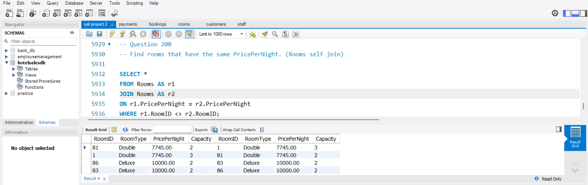
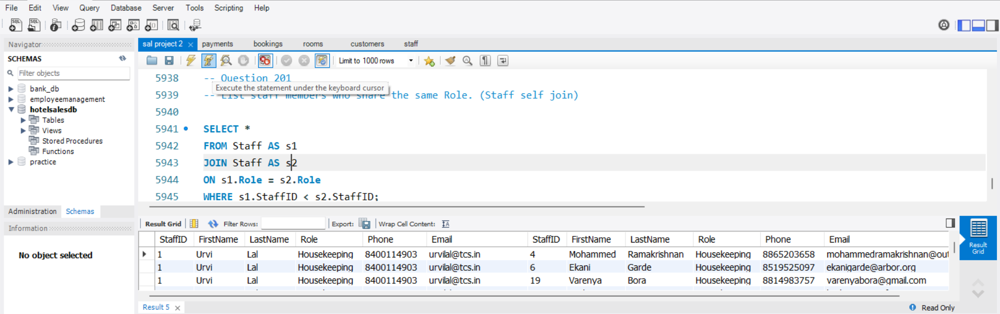
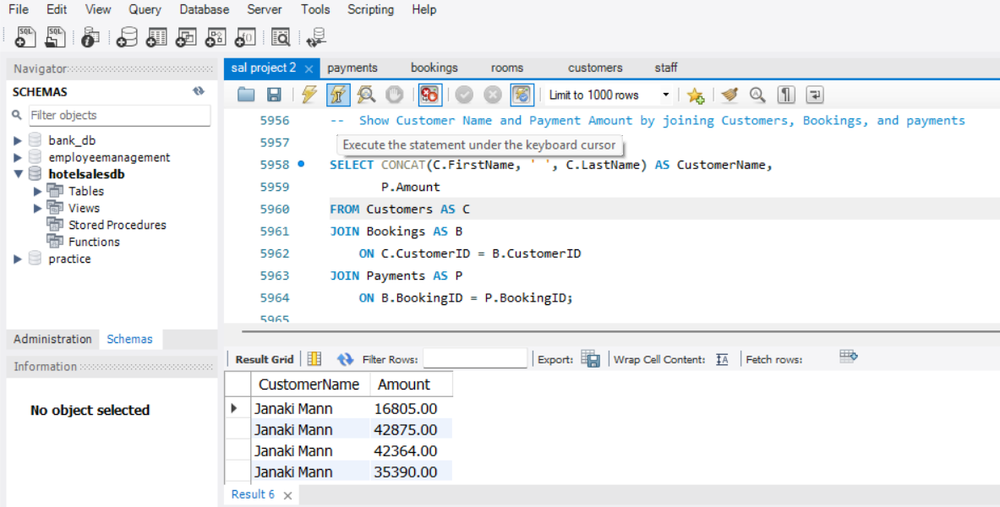
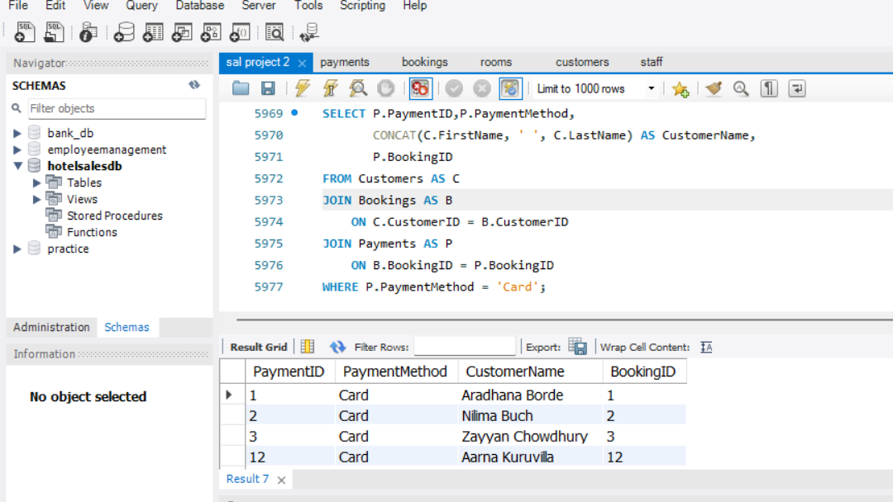
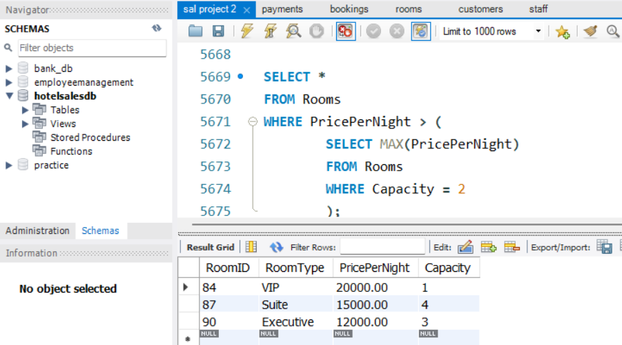
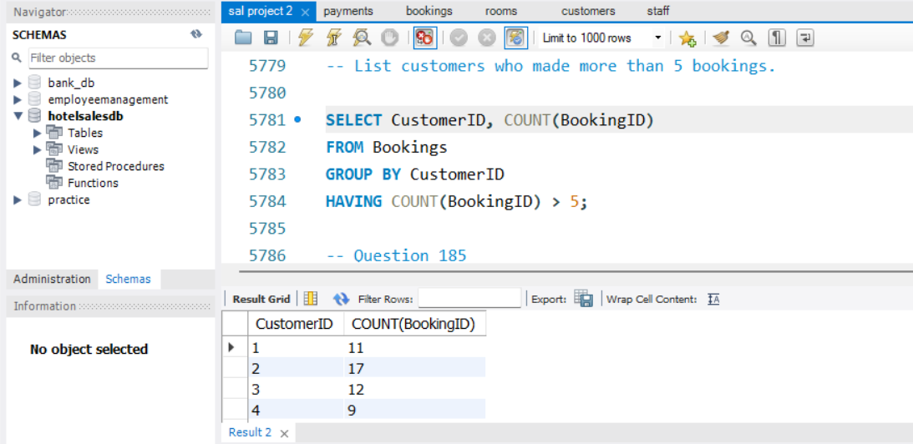
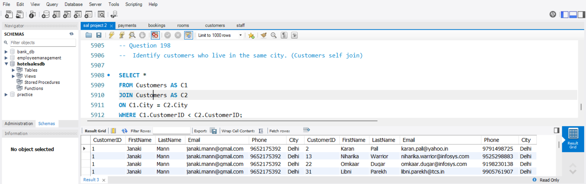

# 🏨 Hotel Management System

A SQL-based Hotel Management System designed to manage customers, rooms, staff, bookings, and payments while practicing real-world SQL database operations and analytical queries.

## 📌 Project Overview

This project is a relational database system developed using **MySQL** for managing core hotel operations.

The database stores and manages information related to:

- Customers
- Rooms
- Staff
- Bookings
- Payments

The project also includes SQL queries covering data retrieval, filtering, aggregation, subqueries, views, joins, self joins, and triggers.

## 🎯 Project Objectives

- Design a relational database for hotel management.
- Create and manage tables using SQL.
- Store customer, room, staff, booking, and payment data.
- Perform data analysis using SQL queries.
- Practice advanced SQL concepts such as joins, subqueries, views, and triggers.
- Understand relationships between multiple database tables.

## 🛠️ Technologies Used

- **MySQL**
- **MySQL Workbench**
- **SQL**
- **Git & GitHub**

## 🗄️ Database Structure

The project contains five main tables:

| Table | Description |
|---|---|
| `Customers` | Stores customer information |
| `Rooms` | Stores room details and pricing |
| `Staff` | Stores hotel staff information |
| `Bookings` | Stores customer room bookings |
| `Payments` | Stores booking payment information |

## 🔗 Table Relationships

```text
Customers
    │
    │ CustomerID
    ▼
Bookings
    │
    │ BookingID
    ▼
Payments

Staff ──────► Bookings
Rooms ──────► Bookings

```

## 💻 SQL Concepts Covered

- Database & Table Creation
- Data Types
- Primary Keys
- Foreign Keys
- Constraints
- INSERT, UPDATE & DELETE
- SELECT & DISTINCT
- WHERE
- ORDER BY
- GROUP BY
- HAVING
- LIMIT
- Aggregate Functions
- String Functions
- Subqueries
- INNER JOIN
- SELF JOIN
- Multi-table JOINs
- Views
- Indexes
- Stored Procedures
- Triggers

## 📸 Query Results

### Rooms SELF JOIN



### Staff SELF JOIN



### Customer & Payment JOIN



### Credit Card Payment JOIN



### Rooms Subquery



### Customers with Multiple Bookings



### Customers from Same City



## ⚙️ How to Run

1. Clone the repository.
2. Open **MySQL Workbench**.
3. Run `database/01_database_setup.sql`.
4. Run `database/02_data_insert.sql`.
5. Execute queries from `queries/01_queries.sql`.

## 📚 Learning Outcomes

Through this project, I practiced designing relational databases and writing SQL queries for real-world hotel management scenarios.

The project helped me strengthen my understanding of database relationships, data manipulation, aggregation, subqueries, joins, views, stored procedures, and triggers.

## 👨‍💻 Author

**Pranav Aseri**

Data Analytics Enthusiast | SQL • Python • Power BI • Excel

[GitHub](https://github.com/PranavAseriz011)
